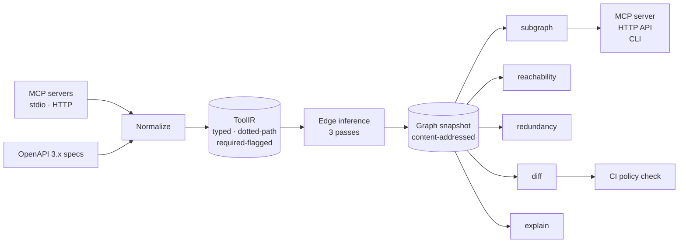
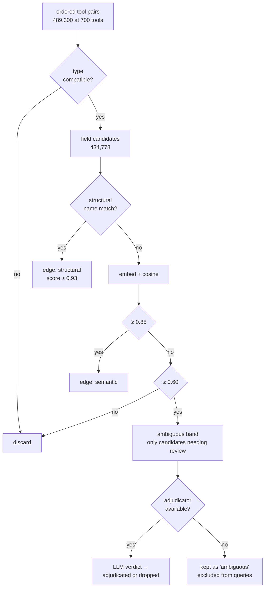
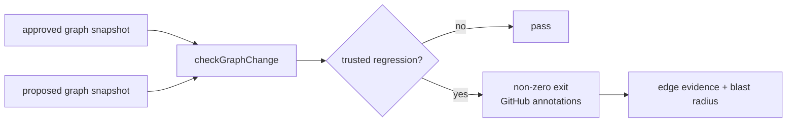

# Architecture

## The problem in one line

MCP standardized how to *call* a tool. Nothing standardizes how tools *connect* — so an agent cannot know that `createIssue` needs the `issueTypeId` only `listIssueTypes` produces.

## Pipeline

## Edge inference: cost-ordered passes

The pair space is quadratic in catalog size, so each pass is gated by the one before it. Only what survives reaches the expensive stage.

**Why this ordering matters.** At 900 tools the naive all-pairs LLM approach is ~800K calls. Type gating plus similarity thresholds reduce the LLM's share to a fraction of a percent of candidates, which is what makes pass 3 affordable at all.

## Precision over recall in the hot path

Every edge carries provenance: `structural`, `semantic`, `adjudicated`, or `ambiguous`.

Unconfirmed `ambiguous` edges are **excluded from queries by default**. They are a build-time diagnostic — a worklist of what adjudication would resolve — not something an agent is told to act on. Measured on the fixture catalog, this is the difference between:

| mode | precision | recall | F1 |
|---|---|---|---|
| trusted (default) | 100.0% | 88.7% | 94.0% |
| including ambiguous band | 88.1% | 99.0% | 93.2% |

A wrong composition hint sends an agent down a failing path and costs more than a missing one, so the default trades recall for precision. Setting `ANTHROPIC_API_KEY` recovers most of that recall by adjudicating the band instead of discarding it.

## Retrieval: closure, not top-k

Seeding by description similarity alone returns `createIssue` and stops. Filura then walks *backward* along dependency edges to pull in producers of required inputs.

Seeds and dependencies compete in a **single best-first priority queue**. Admitting all seeds up front would spend the budget before any dependency was considered, letting a weakly-relevant seed crowd out a tool that actually produces a required input. A dependency inherits `parentPriority × edgeScore × 0.75`, so a strong seed's real dependency outranks a marginal seed.

Producers are only pulled for inputs the agent cannot supply itself: a required `project_id` needs an upstream tool, a required `title` does not.

## Explainability and release policy

The graph is not treated as an oracle. `explainInput` returns the input's
status (`satisfied`, `awaiting-adjudication`, `agent-suppliable`, or
`unresolved`) and separates trusted producers from pending candidates. This
keeps evidence available to an operator without turning a low-confidence match
into an agent instruction.

`checkGraphChange` is the CI-facing counterpart to `diffGraphs`. It fails only
on removed tools/outputs, broken trusted flows, or newly unreachable required
identifiers. Input removals are warnings. This makes the gate useful on a pull
request while avoiding false release blocks caused by an unavailable LLM
adjudicator.

## Evaluation

`eval/ground-truth.json` labels, for 45 identifier-shaped required inputs, every output field that genuinely carries that value — 97 correct producer pairs, derived by reading the fixture schemas rather than by recording Filura's output. A self-recorded baseline would score 1.0 and measure nothing.

Scope excludes free-text inputs (`title`, `summary`, `jql`) where correctness is a matter of taste rather than fact.

`filura eval` reports edge precision/recall/F1 plus goal-level retrieval, and the suite enforces both as regression floors — including an assertion that ground truth still names producers the system misses, which fails loudly if anyone ever regenerates the labels from output. The suite also exercises the release gate with the deliberate `assignee` → `assignee_id` fixture break.

## Known limitations

The default embedder is lexical, not semantic. It handles `userId` / `user_id` / `customerIdentifier` well, but cannot connect a goal phrased as "move a ticket to a done state" with a tool named `transitionIssue` — that goal is the one retrieval failure in the eval set. Hosted embeddings (`FILURA_EMBEDDINGS=voyage|openai`) target exactly this gap.

Accuracy is measured against a catalog whose fixtures were authored alongside the system. Numbers on a large real-world catalog with inconsistent cross-team naming are unknown, and that is the most important open question.
